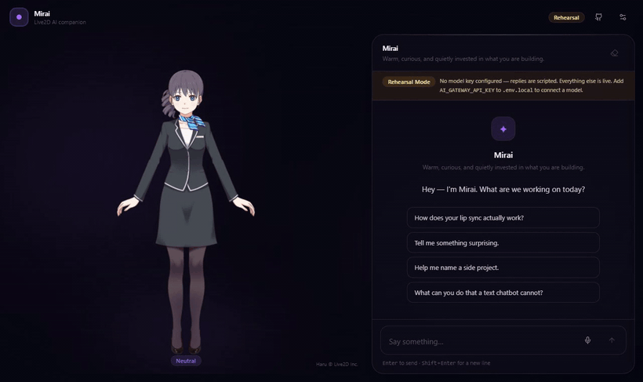
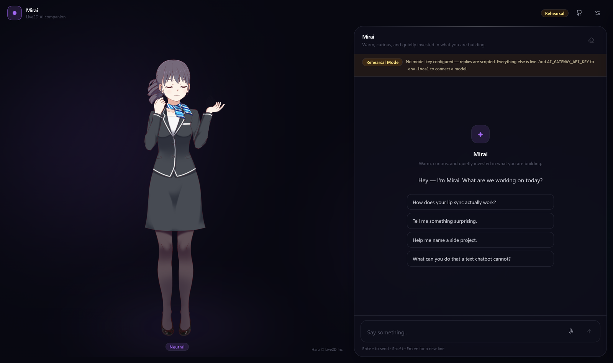
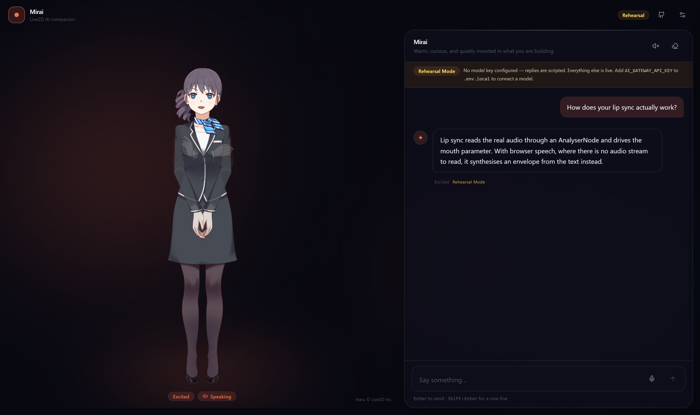
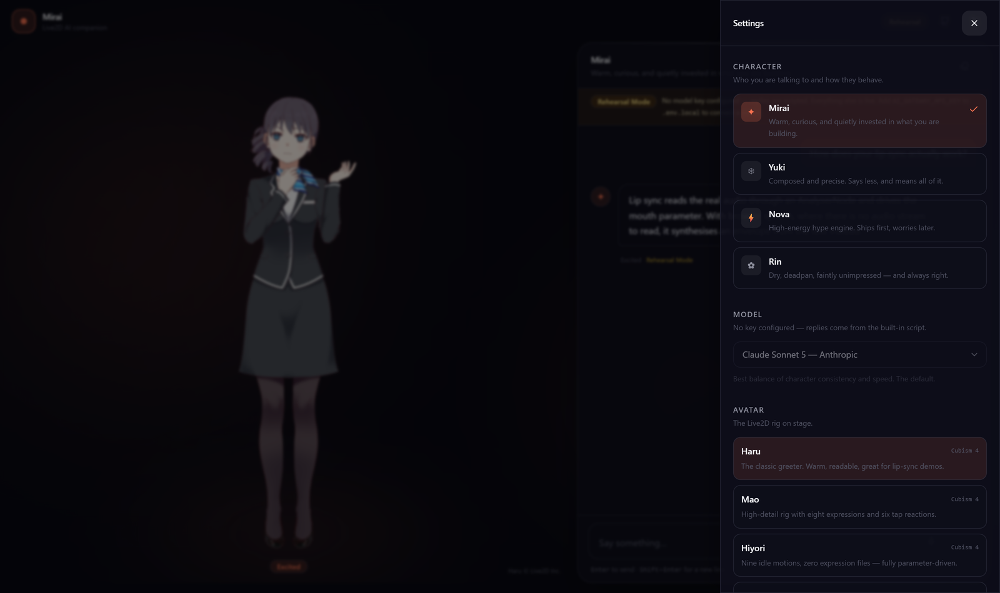
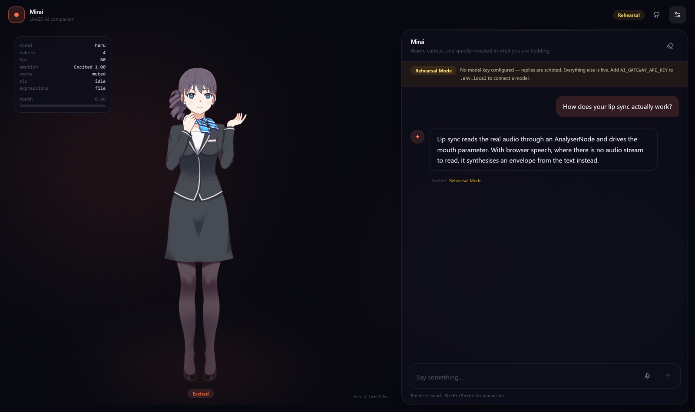
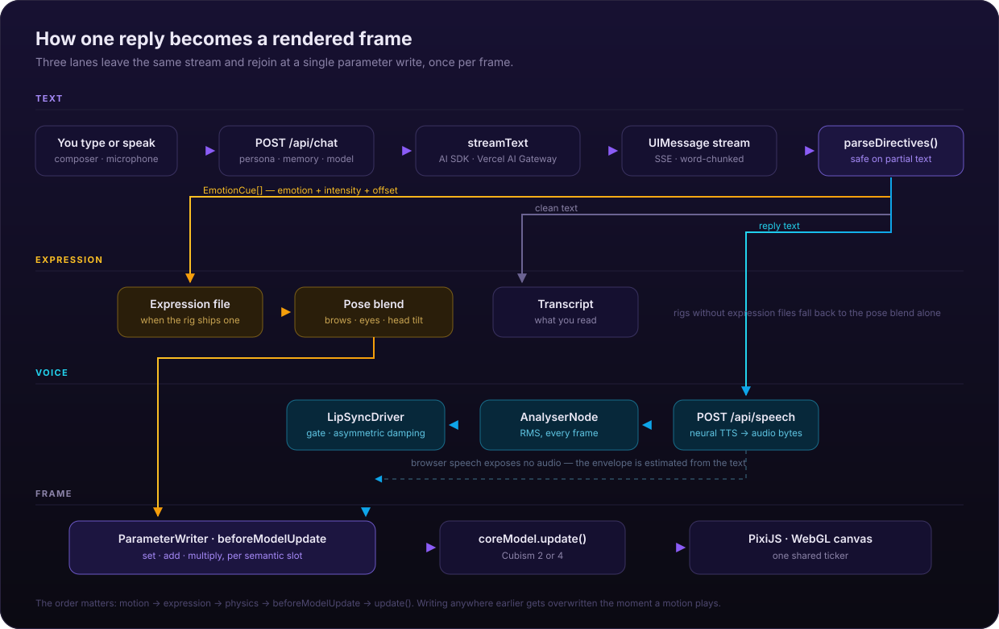

<div align="center">


# Mirai

**A Live2D AI companion that actually reacts.**

Streaming LLM chat wired into a Cubism rig — the expression changes *mid-sentence*,
the mouth follows the real audio waveform, and the whole interface takes on the
colour of whatever she's feeling.

[](https://nextjs.org)
[](https://react.dev)
[](https://www.typescriptlang.org)
[](https://ai-sdk.dev)
[](https://pixijs.com)
[](https://www.live2d.com)
[](#testing)
[](LICENSE)

<br />



<sub>Recorded from the running app in Rehearsal Mode — no API key, nothing faked.</sub>

</div>

---

## The idea

Most "AI avatar" projects bolt a mood badge onto a chat box. The avatar picks a
face when the reply finishes, plays a canned mouth-flap animation, and that's it.
It reads as a chat app with a picture next to it.

Mirai is built the other way around. The character is the interface, and three
things had to be true for that to work:

- **The face reacts on the right word, not after the reply.** The model marks up
  its own answer with inline `[[emotion]]` directives, which are parsed *as they
  stream* and dispatched at the exact character offset they were written for.
- **The mouth follows actual sound.** Speech audio is routed through an
  `AnalyserNode` and the loudness drives the Cubism mouth parameter every frame —
  with a noise gate, asymmetric attack/release, and a decaying peak ceiling,
  because a raw RMS-to-jaw mapping looks obviously wrong.
- **It works before you configure anything.** `git clone && npm run dev` gives you
  a blinking, breathing, lip-syncing character with no key, no account, no
  credit card.

---

## Quick start

```bash
git clone https://github.com/juliandavid0610/mirai.git
cd mirai
npm install
npm run dev
```

Open <http://localhost:3000>. That's it — the app boots in **Rehearsal Mode**,
where replies come from a small built-in script but *everything else is live*:
the rig, the streaming, the directive parser, the expression engine, the lip sync
and the browser voice.

To connect a real model, add one key:

```bash
cp .env.example .env.local
# AI_GATEWAY_API_KEY=...
```

One [Vercel AI Gateway](https://vercel.com/ai-gateway) key covers chat, neural
speech and transcription. Restart, and the banner disappears.

<details>
<summary><strong>Using a different provider</strong></summary>

Every model id in `src/lib/ai/models.ts` is a Gateway route
(`anthropic/claude-sonnet-5`, `openai/gpt-5.5`, `google/gemini-3.8-flash`, …), so
switching vendor at runtime is a dropdown. To bypass the Gateway entirely,
install a provider package and swap the `model:` argument in
`src/app/api/chat/route.ts` — nothing else in the app knows which provider it is
talking to.

</details>

---

## What it does

|  |  |
| --- | --- |
| **Emotion-driven expressions** | Nine emotions, mapped to each rig's own expression files where they exist and to hand-tuned Cubism parameter poses where they don't. |
| **Real lip sync** | Amplitude-driven from decoded TTS audio. Falls back to a syllable-estimated envelope when the browser's speech API is used, since it exposes no audio stream by design. |
| **Voice in and out** | `SpeechRecognition` where it exists (Chrome, Edge, Safari), server-side Whisper transcription where it doesn't (Firefox). Same button either way. |
| **Four personas** | Complete character definitions — brief, speech rules, boundaries, expressiveness, voice, temperature — not one-line "act like X" prompts. Editable and exportable. |
| **Five rigs, two runtimes** | Cubism 4 and Cubism 2, switchable at runtime. Drop your own into `public/models/`. |
| **Reactive theming** | The accent colour, focus rings, backdrop and selection colour all derive from one live CSS variable that follows the character's mood. |
| **On-device memory** | Facts you choose are sent with each request and stored only in your browser. No server-side profile, no database. |
| **Zero-config fallbacks** | Missing key, missing speech model, blocked microphone, no `localStorage`, no WebGL — each degrades to something that still works. |

<table>
<tr>
<td width="50%"></td>
<td width="50%"></td>
</tr>
<tr>
<td><sub><b>Idle.</b> Secondary sway on three incommensurable sines, so the loop never visibly repeats.</sub></td>
<td><sub><b>Streaming.</b> The emotion cue has fired mid-reply and the whole UI has followed it.</sub></td>
</tr>
<tr>
<td></td>
<td></td>
</tr>
<tr>
<td><sub><b>Settings.</b> The avatar stays live behind the sheet so you can watch sliders take effect.</sub></td>
<td><sub><b>Diagnostics.</b> Live FPS, emotion, mouth parameter, and any rig parameters that failed to map.</sub></td>
</tr>
</table>

---

## How it works

<div align="center">
  
</div>

Three details are doing most of the work.

### 1. Directives that survive a partial stream

The model writes `[[joy:0.8]]` inline. The parser runs against the accumulated
text on every chunk, which means it constantly sees tags cut in half:

```
"Okay. [[surpr"     →  text: "Okay."          pendingTail: true
"Okay. [[surprised]"→  text: "Okay."          pendingTail: true
"Okay. [[surprised]] That's odd."
                    →  text: "Okay. That's odd."   cue: surprised @ 6
```

Anything that could still become a directive is withheld from the visible text,
so a tag split across a chunk boundary never flashes on screen. Tags inside code
spans and fenced blocks are left completely alone — an assistant explaining its
own protocol writes `` `[[joy]]` `` in backticks, and eating that produces the
memorably baffling output *"inline `` markers"*.

> A tool call or a structured-output schema would be tidier, but both arrive
> *after* the text. The face would always react a beat late.

### 2. Lip sync that doesn't look like a volume meter

Driving `ParamMouthOpenY` straight from RMS looks wrong in three specific ways,
and [`lip-sync.ts`](src/lib/live2d/lip-sync.ts) fixes each one:

| Problem | Fix |
| --- | --- |
| Mouth flaps, or lags | Asymmetric damping — jaws open fast and close slowly |
| Jaw never fully closes | A noise gate above room tone (~0.018 RMS) |
| Quiet voices barely move, loud ones gape | A peak that decays ~40 %/s and normalises against it |

When there's no audio to analyse — browser `SpeechSynthesis` deliberately exposes
none — a syllable envelope is estimated from the text instead, and pulses are
shaped with a raised cosine so there are no clicks at the edges.

### 3. Blending instead of stamping

Every parameter write declares *how* it combines with whatever the rig already
wrote this frame:

- **`add`** for head and body angles, so an emotional head-tilt rides on top of
  pointer tracking rather than cancelling it.
- **`multiply`** for eye-open, so a half-lidded `sleepy` face **still blinks**.
  Writing eye-open absolutely freezes the eyelids and kills the runtime's
  auto-blink — uncanny in a way that's hard to place until you notice the
  character hasn't blinked in a minute.
- **`set`** for everything else.

All of it happens inside the model's `beforeModelUpdate` hook. The Cubism update
order is `motion → expression → physics → beforeModelUpdate → update()`, so that
is the only point where a write is guaranteed to survive to the rendered frame.
Writing from a ticker callback appears to work and then mysteriously gets
overwritten the moment a motion starts playing.

More detail in [`docs/ARCHITECTURE.md`](docs/ARCHITECTURE.md).

---

## Configuration

Everything is optional.

| Variable | Default | What it controls |
| --- | --- | --- |
| `AI_GATEWAY_API_KEY` | — | Unlocks chat, speech and transcription. Without it: Rehearsal Mode. |
| `MIRAI_DEFAULT_MODEL` | `anthropic/claude-sonnet-5` | Model used when the client doesn't pick one. |
| `MIRAI_SPEECH_MODEL` | `openai/tts-1-hd` | Neural voice. Blank ⇒ browser speech. |
| `MIRAI_SPEECH_VOICE` | `nova` | Default voice id. |
| `MIRAI_TRANSCRIBE_MODEL` | `openai/whisper-1` | Used where the browser has no `SpeechRecognition`. |
| `MIRAI_RATE_LIMIT_REQUESTS` | `30` | Requests per window, per IP, per route. |
| `MIRAI_RATE_LIMIT_WINDOW_SECONDS` | `60` | Window length. |
| `NEXT_PUBLIC_SITE_URL` | `http://localhost:3000` | Used for Open Graph metadata. |

`GET /api/capabilities` reports what the running deployment can actually do; the
client boots against it rather than guessing.

---

## Bringing your own character

The bundled rigs are Live2D's official sample models, loaded from a CDN — they're
licensed, not public domain, so they aren't vendored here and the credit stays
visible in the corner of the stage.

To add your own, drop it in `public/models/` and add an entry to
[`src/lib/live2d/catalog.ts`](src/lib/live2d/catalog.ts):

```ts
{
  id: 'my-character',
  name: 'My Character',
  tagline: 'Something short for the picker.',
  url: '/models/my-character/my-character.model3.json',
  cubism: 4,
  credit: { author: 'You', license: 'Your licence', url: '' },
  transform: { scale: 0.9, anchorX: 0.5, anchorY: 0.5, offsetX: 0, offsetY: 0 },
  expressions: { joy: 'exp_02', sad: 'exp_05' },   // optional
}
```

Omit `expressions` entirely and the rig runs on the parameter poses alone — which
is exactly how Hiyori works, since she ships no expression files at all. Turn on
the diagnostics overlay to see which parameters your rig didn't recognise.

Full guide: [`docs/LIVE2D.md`](docs/LIVE2D.md).

---

## Project structure

```
src/
├── app/
│   ├── api/
│   │   ├── chat/          streamText + the keyless Rehearsal fallback
│   │   ├── speech/        neural TTS → audio bytes
│   │   ├── transcribe/    Whisper, for browsers without SpeechRecognition
│   │   └── capabilities/  what this deployment can actually do
│   ├── layout.tsx         metadata, CDN preconnects
│   └── opengraph-image.tsx
├── components/
│   ├── live2d/            stage, status, diagnostics, stage context
│   ├── chat/              transcript, bubbles, composer, renderer
│   ├── settings/          drawer, persona/avatar pickers, memory
│   ├── layout/            shell, top bar, aurora backdrop, theme bridge
│   └── ui/                button, slider, switch, select, panel, badge
├── hooks/                 stage lifecycle, chat orchestration, mic, capabilities
├── lib/
│   ├── live2d/            runtime loader, catalog, parameter writer,
│   │                      expression map, lip sync, idle, stage
│   ├── ai/                directives, personas, prompt, models, rehearsal
│   ├── audio/             audio bus, voice player, microphone
│   ├── store/             settings, personas, memory, stage (zustand)
│   └── utils/             math, storage, rate limit, logger, ids
└── types/                 emotion, live2d, persona, chat
```

---

## Scripts

| Command | Does |
| --- | --- |
| `npm run dev` | Dev server |
| `npm run build` / `npm start` | Production build and serve |
| `npm test` | 140 unit tests |
| `npm run test:coverage` | Coverage over `src/lib` |
| `npm run typecheck` | `tsc --noEmit`, strict + `noUncheckedIndexedAccess` |
| `npm run lint` | ESLint flat config |
| `node scripts/capture-screenshots.mjs` | Regenerates the README screenshots from the running app |
| `node scripts/capture-demo.mjs` | Regenerates `demo.gif` (needs `ffmpeg-static` or a system ffmpeg) |

<details>
<summary><strong>If Turbopack crashes on your machine</strong></summary>

Turbopack's native binary requires CPU instructions some older and virtualised
hosts don't have; it exits with `0xC000001D` (illegal instruction) before
printing anything useful. `npm run dev:webpack` and `npm run build:webpack` use
the webpack pipeline instead. Output is identical.

</details>

---

## Testing

140 unit tests, run with Vitest, concentrated on the parts where a bug is
invisible until it's embarrassing:

- **`directives.test.ts`** — feeds a reply in one character at a time and asserts
  no tag fragment is ever visible; covers code spans, unknown emotions,
  intensity clamping and cue offsets.
- **`lip-sync.test.ts`** — asserts the noise gate holds, that opening really is
  faster than closing, that quiet and loud sources normalise to a similar range,
  and that no input produces `NaN`.
- **`math.test.ts`** — proves `damp()` converges identically at 60 Hz and 144 Hz,
  which is the entire reason it exists.
- **`expression-map.test.ts`** — guards the blend modes, because the difference
  between `set` and `multiply` on eye-open is a character that stops blinking.
- **`stores.test.ts`** — includes a regression guard for the zustand selector
  that once caused an infinite render loop.
- Plus prompt construction, the model allow-list, rate limiting and the message
  renderer.

```bash
npm test
```

---

## Built with

[Next.js 16](https://nextjs.org) · [React 19](https://react.dev) ·
[AI SDK 7](https://ai-sdk.dev) · [Vercel AI Gateway](https://vercel.com/ai-gateway) ·
[PixiJS 6](https://pixijs.com) ·
[pixi-live2d-display](https://github.com/guansss/pixi-live2d-display) ·
[Live2D Cubism](https://www.live2d.com) · [Tailwind CSS 4](https://tailwindcss.com) ·
[Zustand](https://zustand.docs.pmnd.rs) · [Vitest](https://vitest.dev)

> PixiJS is pinned to v6 on purpose. `pixi-live2d-display` declares peer
> dependencies on the `@pixi/*` v6 packages, so installing PixiJS 7 alongside it
> resolves **two** copies of `@pixi/core` — and a v6 `Container` added to a v7
> stage fails at runtime in a way that is genuinely unpleasant to debug.

---

## Roadmap

- [ ] Persona editor UI (the data model and storage already support it)
- [ ] Streaming TTS, so speech starts before the reply finishes
- [ ] WebGPU renderer path
- [ ] Optional server-side conversation persistence
- [ ] Physics-driven hair and cloth tuning per rig

---

## Credits

Character rigs are Live2D's official sample data — **Haru, Mao, Hiyori, Natori,
Shizuku** — © Live2D Inc., used under the
[Free Material License](https://www.live2d.com/en/download/sample-data/).
They are fetched from a CDN, not redistributed here.

The Cubism Core runtime is proprietary and loaded at runtime from Live2D's own
CDN. Shipping a copy is not permitted; see [`docs/LIVE2D.md`](docs/LIVE2D.md).

## License

[MIT](LICENSE) © [juliandavid0610](https://github.com/juliandavid0610)

The MIT licence covers this repository's source. It does **not** cover the Live2D
Cubism runtime or the sample character data, which carry their own terms.
